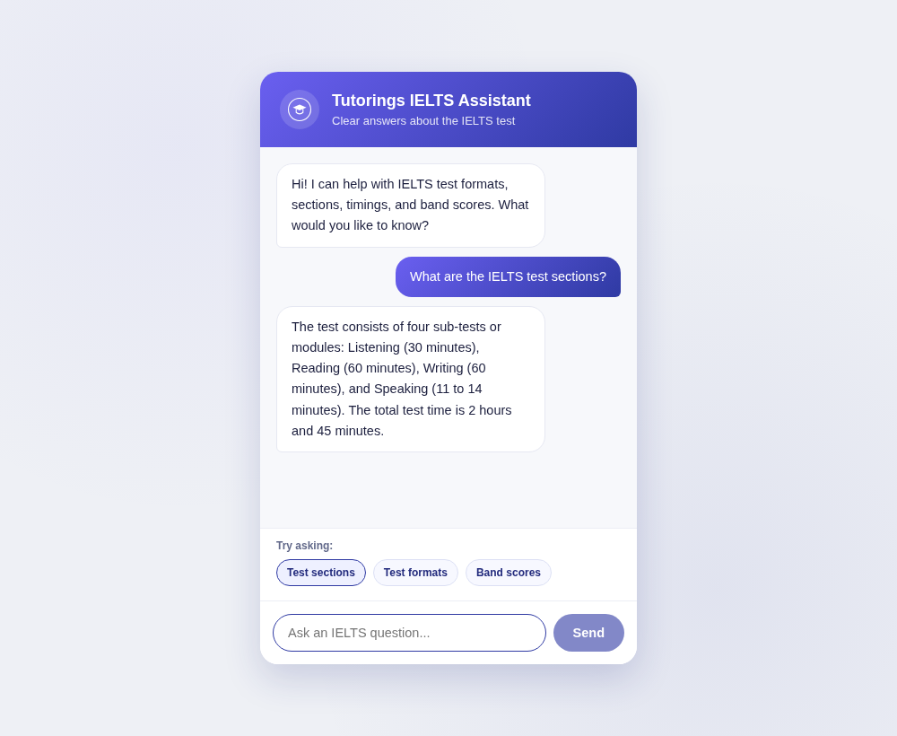

# Tutorings IELTS Assistant

A lightweight, Gemini-powered chatbot that helps learners understand the IELTS exam. It answers common questions about test formats, sections, timings, and band scores through a friendly chat interface.

Built collaboratively by Aishah and Hanouf.



## Features

- A focused IELTS knowledge base covering the Academic and General Training tests.
- Clear chat interface with suggested questions to help learners get started.
- Responsive design that works well on desktop and mobile screens.
- Secure Gemini integration: the API key stays on the Node server and never reaches the browser.
- A built-in knowledge-base fallback, so the app remains useful before Gemini is configured.
- A small, dependency-free Node server with input validation, rate limiting, request timeouts, and security headers.

## Run locally

This project uses Node.js 18 or later. From the repository root, run:

```bash
npm start
```

Then open <http://localhost:3000> in your browser. Without a key, the chatbot uses its IELTS knowledge-base fallback.

## AI integration

To enable Gemini, create a local environment file:

```bash
cp .env.example .env
```

Open `.env` and replace `your_new_gemini_api_key` with a **newly created** Gemini key, then run `npm start` again. The browser sends questions only to `/api/chat`; the Node server reads the key and calls Gemini. The real `.env` file is ignored by Git.

Never add a key to files in `chatbot/` or commit `.env`.

## Project structure

```text
chatbot/
├── index.html          # Page structure and suggested prompts
├── style.css           # Responsive chat interface styling
├── app.js              # Chat interactions and UI states
├── data.js             # IELTS knowledge-base content
├── assistant.js         # Browser-to-server chat request and fallback
└── config.js            # Safe public API endpoint configuration
server.js                # Static server and secure Gemini proxy
.env.example             # Safe environment-variable template
```

## Try asking

- What is the difference between IELTS Academic and General Training?
- How long is the Speaking test?
- How are IELTS band scores calculated?

## Collaboration

This project was built by Aishah and Hanouf. If you extend it, keep contributions documented and agree together before changing shared repository settings such as visibility or history.
